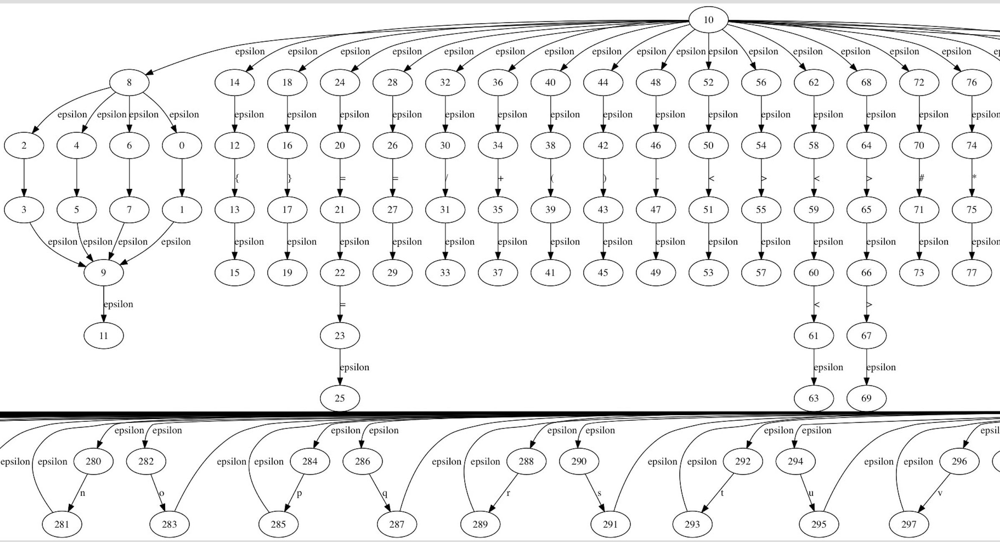
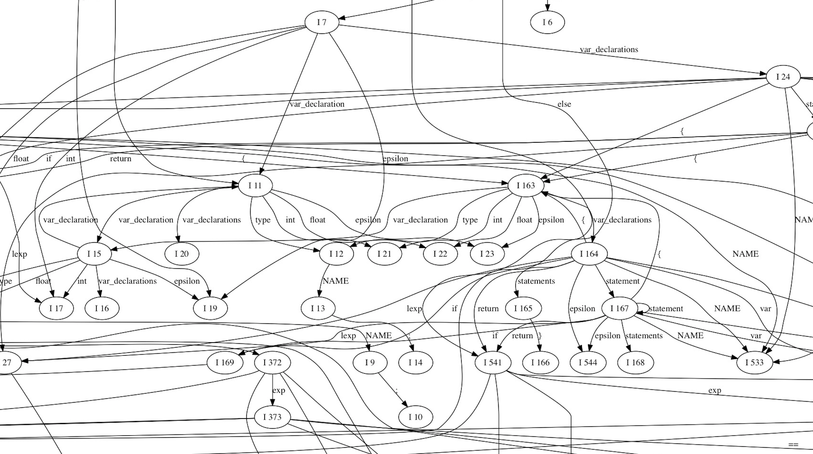
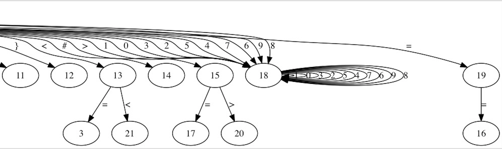

# Compiler
东南大学编译原理课程设计——基于python的lex和yacc

## Partner(equal contribution)

|Partner | Contribution|
|----|----|
|[@Zhixin Piao](https://github.com/a367) | lex与yacc的文件读取，状态图的生成，最后代码整合 |
|[@Shengjia Yan](https://github.com/yanshengjia) | RE  NFA，LR(1)总控程序的实现 |
|[@Ruiming wang]()|NFA  DFA，DFA最小化，LR(1) GOTO图、预测分析表的生成|

## Visualization
NFA部分可视化结果（[完整版](graph/nfa.png)）：

GOTO图部分可视化结果（[完整版](graph/goto.png)）：

DFA部分可视化结果（[完整版](graph/dfa.png)）：

